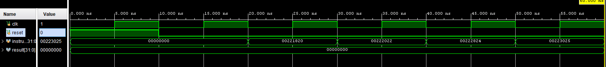
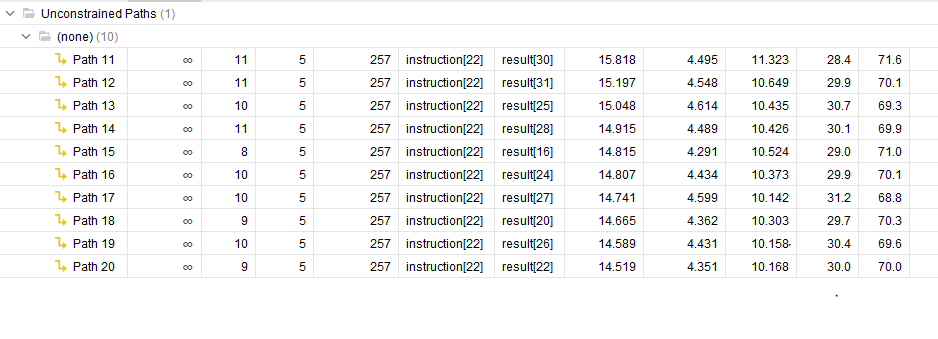
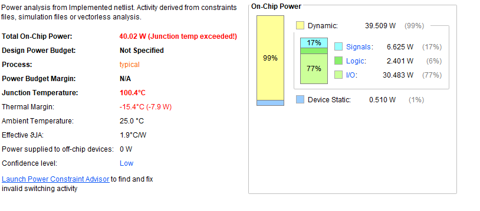

# 32-Bit Single-Cycle CPU Design in Verilog

A modular 32-bit Single-Cycle CPU implemented using Verilog HDL. The processor integrates a Control Unit, Register File, Arithmetic Logic Unit (ALU), and Program Counter (PC) to execute basic arithmetic and logical operations.

This project demonstrates fundamental processor design concepts, RTL development, simulation, synthesis, timing analysis, power analysis, and FPGA implementation flow.

---

## Project Overview

The CPU executes instructions through the following stages:

1. Instruction Fetch
2. Instruction Decode
3. Register Read
4. Execute (ALU Operations)
5. Write Back
6. Program Counter Update

The design follows a modular architecture, making it easy to understand and extend for educational and research purposes.

---

## Features

✔ 32-bit Architecture

✔ Modular RTL Design

✔ Register File Implementation

✔ Arithmetic Logic Unit (ALU)

✔ Control Unit

✔ Program Counter

✔ Functional Simulation

✔ Timing Analysis

✔ Power Analysis

✔ FPGA Resource Utilization Report

✔ Vivado Compatible Design

---

## Architecture

```text
                     +----------------+
                     |  Instruction   |
                     +--------+-------+
                              |
                              v
                     +----------------+
                     | Control Unit   |
                     +--------+-------+
                              |
                              v
+--------------+      +---------------+      +-------------+
| RegisterFile |----->|      ALU      |----->|   Result    |
+--------------+      +---------------+      +-------------+
                              ^
                              |
                       +-------------+
                       |     PC      |
                       +-------------+
```

---

## Directory Structure

```text
Simple-32bit-CPU-Verilog
│
├── src
│   ├── CPU.v
│   ├── ALU.v
│   ├── ControlUnit.v
│   ├── RegisterFile.v
│   └── PC.v
│
├── testbench
│   └── CPU_tb.v
│
├── results
│   ├── waveform.png
│   ├── timing_report.png
│   ├── power_analysis.png
│   └── utilization_report.png
│
└── README.md
```

---

## Module Description

### CPU.v

Top-level module connecting all processor components.

Responsibilities:

- Instantiates ALU
- Instantiates Register File
- Instantiates Control Unit
- Instantiates Program Counter
- Controls data flow

---

### ControlUnit.v

Generates control signals based on instruction opcode.

Control Signals:

- RegWrite
- ALUOp
- MemRead
- MemWrite
- Branch
- Jump

---

### RegisterFile.v

Stores processor registers.

Features:

- 32 Registers
- Two Read Ports
- One Write Port
- Synchronous Write
- Asynchronous Read

---

### ALU.v

Performs arithmetic and logical operations.

Supported Operations:

| ALUOp | Operation |
|---------|---------|
| 0000 | ADD |
| 0001 | SUB |
| 0010 | AND |
| 0011 | OR |
| 0100 | XOR |
| 0101 | SLT |

---

### PC.v

Program Counter module.

Functions:

- Stores current instruction address
- Increments by 4 every clock cycle
- Supports reset operation

---

## Inputs and Outputs

### Inputs

| Signal | Width | Description |
|----------|----------|-------------|
| clk | 1 | System Clock |
| reset | 1 | Active High Reset |
| instruction | 32 | Input Instruction |

### Outputs

| Signal | Width | Description |
|----------|----------|-------------|
| result | 32 | ALU Result |

---

## Simulation

The design was verified using a custom Verilog Testbench.

### Test Cases

- Reset Verification
- ADD Operation
- SUB Operation
- AND Operation
- OR Operation
- XOR Operation
- SLT Operation

---

## Waveform Verification

The simulation waveform confirms:

- Correct clock operation
- Proper reset functionality
- Instruction execution
- ALU result generation

### Simulation Result



---

## Timing Analysis

Timing analysis was performed after synthesis.

### Observations

- Critical path successfully identified
- Timing paths analyzed
- No functional timing violations observed

### Timing Report



---

## Resource Utilization

Resource utilization report generated using Vivado.

### Utilized Resources

| Resource | Utilization |
|-----------|------------|
| LUT | 2% |
| FF | 1% |
| BUFG | 3% |
| IO | 18% |

### Utilization Report


---

## Power Analysis

Power estimation was performed after implementation.

Parameters Evaluated:

- Dynamic Power
- Static Power
- Junction Temperature
- Thermal Margin

### Power Report



---

## Tools Used

### Design

- Verilog HDL

### Simulation

- Vivado Simulator
- ModelSim
- QuestaSim
- Icarus Verilog

### Analysis

- Vivado Synthesis
- Vivado Implementation
- Timing Analyzer
- Power Analyzer
- Area Analyzer

---

## How to Run

### Compile

```bash
iverilog -o cpu_sim \
CPU.v \
ALU.v \
ControlUnit.v \
RegisterFile.v \
PC.v \
CPU_tb.v
```

### Run

```bash
vvp cpu_sim
```

### Generate Waveform

Add:

```verilog
initial begin
    $dumpfile("cpu.vcd");
    $dumpvars(0, CPU_tb);
end
```

View:

```bash
gtkwave cpu.vcd
```

---

## Results Summary

| Parameter | Status |
|------------|---------|
| RTL Design | Completed |
| Functional Simulation | Passed |
| Synthesis | Completed |
| Timing Analysis | Completed |
| Power Analysis | Completed |
| Resource Utilization | Completed |

---

## Applications

- Processor Design Learning
- Computer Architecture Education
- FPGA Development
- RTL Design Training
- VLSI Design Practice
- Embedded System Development

---

## Future Improvements

- Data Memory Integration
- Instruction Memory
- Branch Prediction
- Hazard Detection Unit
- Pipeline Architecture
- Cache Memory
- RISC-V Instruction Support
- FPGA Board Deployment

---

## Skills Demonstrated

- Verilog HDL
- RTL Design
- Digital Logic Design
- FPGA Design Flow
- Processor Architecture
- Functional Verification
- Timing Analysis
- Power Analysis
- Computer Organization
- VLSI Design Fundamentals

---

## Author

### Sushmitha Sakthivel

Electronics and Communication Engineering

Skills:
- Verilog HDL
- Digital Design
- Embedded Systems
- Java Backend Development
- FPGA Design
- VLSI Design

---

## GitHub Topics

```text
verilog
rtl-design
cpu-design
digital-design
fpga
vlsi
computer-architecture
processor-design
single-cycle-cpu
vivado
```

---

## License

This project is released under the MIT License.

Feel free to use, modify, and distribute for educational and research purposes.
